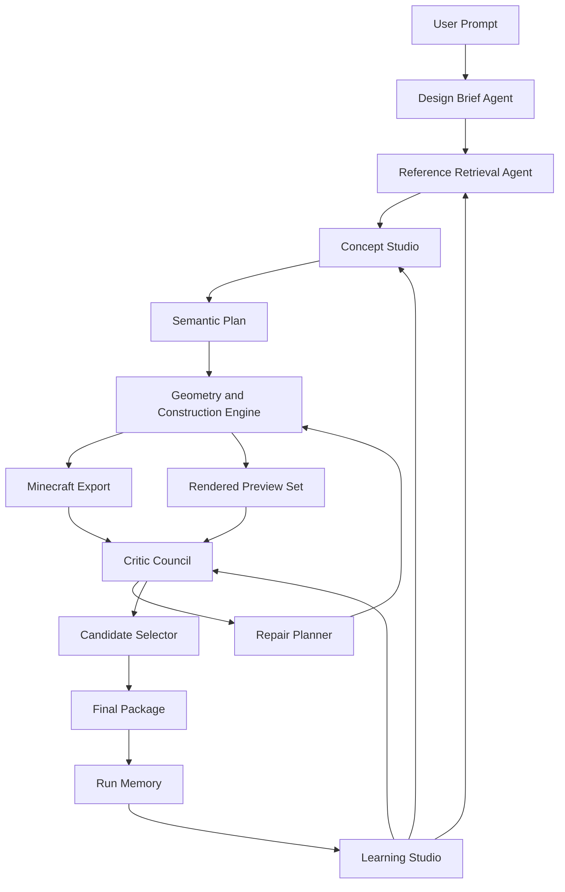

# Minecraft Architecture Master Agent 长期路线图

日期：2026-07-09

## 1. 愿景

早期原型已经证明了一件事：把中文建筑需求转成 Minecraft Java 1.21 可执行数据包是可行的。下一阶段的目标不再是“完成一次生成”，而是把系统长期打磨成一个 **Minecraft 建筑大师 Agent**。

这里的“建筑大师”不是单一神经网络，也不是简单模板拼接，而是一个会看、会学、会想、会造、会评、会改的混合智能体系统：

- 会看：能分析优秀 schematic，理解体块、比例、立面、屋顶、动线、室内、庭院和地形关系。
- 会学：能把作品变成案例、规则、参数、语义体素、检索索引和训练样本。
- 会想：能根据模糊需求提出多个设计概念，而不是只套一个固定模板。
- 会造：能把设计概念落成合法、连通、可安装、可检查的 Minecraft 建筑。
- 会评：能从功能、风格、视觉、场地、叙事和可玩性几个维度评价自己的作品。
- 会改：能根据评价结果迭代修正，而不是一次生成后结束。

长期目标是让用户输入一句话，例如“在湖边建一座带庭院的现代日式住宅，适合隐居和看日落”，系统能自动完成：

1. 理解需求和约束。
2. 检索并吸收相关参考案例。
3. 生成多个概念方案。
4. 选择最强方案并融合优点。
5. 建造结构、室内、立面和场地。
6. 自动评价和修复。
7. 输出 datapack、预览、评分报告和可解释设计说明。

## 2. 当前基础

当前项目已经有很好的起点：

- 主流程是 `LLM 语义 JSON + 本地确定性几何引擎`。
- LLM 不直接输出方块坐标，负责高层语义。
- 本地 JavaScript 负责 CSG 外壳、BSP 房间切分、A* 连通、内饰写入、方块校验和数据包导出。
- 已有 `64` 个本地 schematic 模板，其中 `House` 约 `30` 个。
- 已有模板分析产物：`template_index.json`、`case_library.json`、`retrieval_index.json`、`design_laws.json`、`semantic_clauses.jsonl`。
- 已蒸馏出 `91` 条设计法则和 `76` 条室内法则。
- 已有候选择优、审美审查、模板吸收、设计法则运行时等模块雏形。

因此下一步不应该推倒重来。最好的路线是把当前系统升级为一个分层的建筑智能体：

```text
自然语言需求
-> 设计简报
-> 参考案例检索
-> 概念方案生成
-> 语义体块与空间图
-> 几何生成与 Minecraft 落块
-> 多维评价
-> 自动修复与候选择优
-> 人类反馈进入长期记忆
```

## 3. 核心原则

### 3.1 不把完整方块矩阵作为第一目标

完整 Minecraft 建筑是巨大的稀疏 3D 离散结构。直接训练“文本或标签 -> 全量方块矩阵”会遇到几个问题：

- 数据量不足，当前 `64` 个模板远远不够。
- 方块 token 太多，且有方向、状态和版本差异。
- 大建筑尺寸差异大，难以直接对齐。
- 只学矩阵容易学到外形碎片，学不到动线、尺度和建筑意图。
- RTX 4060 更适合小模型、局部模型、语义体素模型和检索模型。

所以长期路线采用层级表示：

```text
block grid          原始方块与状态，负责最终导出
semantic voxel      粗粒度语义体素，例如墙、屋顶、玻璃、楼板、楼梯、地形、水体
design graph        房间、动线、视线、入口、庭院、景观节点
style grammar       风格、材料、屋顶、立面、细节和构图规则
case memory         模板案例、标签、评分、来源、可复用片段
rendered views      多角度图像，用于视觉评价和人类审查
```

神经网络先学习中间层，而不是直接学习最终方块层。

### 3.2 神经网络是一个器官，不是整个大脑

神经网络适合做：

- 风格分类。
- 标签补全。
- 案例检索。
- 参数预测。
- 粗语义体素生成。
- 局部结构补全。
- 渲染图像的视觉质量评估。

规则与程序适合做：

- 方块合法性。
- 门、楼梯、通路、净空和房间连通。
- Minecraft 版本兼容。
- 数据包导出。
- 约束修复。
- 可复现生成。

LLM 适合做：

- 理解用户需求。
- 生成设计意图。
- 总结参考案例。
- 在多个候选方案之间解释取舍。
- 把评价结果转成修复计划。

最终系统应该是混合式的，不是单模型独裁。

### 3.3 每次生成都要留下可学习数据

系统不能只输出建筑，还要输出训练资产：

- 用户需求。
- 设计简报。
- 参考案例。
- 中间参数。
- 生成结果。
- 自动评分。
- 人类评分。
- 修改记录。
- 成功和失败原因。

长期来看，这些运行记录会比最初的模板库更有价值。

### 3.4 评价体系必须先于高级生成

如果没有稳定评价体系，系统不知道什么叫“更好”。因此“建筑大师”路线必须先建设评价和回归基准，再追求复杂神经生成。

评价要覆盖：

- 可建造性：方块合法、数据包可运行、没有明显悬空错误。
- 可通行性：入口、门、楼梯、走廊、房间连通。
- 可居住性：房间功能、家具摆放、净空、采光。
- 风格一致性：材料、屋顶、窗、比例和装饰符合目标风格。
- 视觉构图：轮廓、层次、主次、入口、视线焦点。
- 场地整合：地形、水体、道路、庭院和建筑关系。
- 叙事感：建筑是否像有用途、有主人、有故事。

## 4. 目标架构



### 4.1 Design Brief Agent

把用户输入转成稳定的设计简报：

- 建筑类型：住宅、城堡、塔楼、寺庙、公共建筑、村庄片区。
- 风格：现代、欧式、中式、日式、哥特、中世纪、海滨、沙漠、奇幻等。
- 场地：平地、湖边、山坡、森林、岛屿、悬崖、城市街区。
- 规模：宽、深、高、层数、院落、塔楼、地下空间。
- 功能：房间清单、公共空间、私密空间、工作空间、景观空间。
- 情绪和叙事：隐居、豪宅、庄严、温暖、神秘、未来感。
- 硬约束：Minecraft 版本、最大尺寸、材料限制、是否需要 datapack。

### 4.2 Reference Retrieval Agent

从模板库、设计法则和历史运行记忆中检索参考：

- 结构参考：体块、屋顶、塔楼、入口、庭院。
- 风格参考：材料、窗型、檐口、立面层次。
- 室内参考：房间功能、家具组、灯光层。
- 场地参考：水边、地形台地、道路、花园、围墙。
- 风险参考：哪些模板不适合直接学习，哪些案例需要缩放或过滤。

检索结果不用于复制原模板，而用于提供设计语法和评价标准。

### 4.3 Concept Studio

同一需求生成多个方案，例如：

- 方案 A：强视觉轮廓，适合展示截图。
- 方案 B：空间布局更合理，适合居住和探索。
- 方案 C：更大胆创意，适合形成记忆点。

每个方案都要包含：

- 设计意图。
- 体块组合。
- 平面组织。
- 立面策略。
- 屋顶策略。
- 场地策略。
- 风险和修复计划。

后续 Candidate Selector 可以选择一个方案，也可以融合多个方案的优点。

### 4.4 Semantic Plan

生成器的中间表示不直接是方块，而是几类可检查结构：

- `massingPlan`：体块、层数、轴线、入口、塔楼、露台。
- `spaceGraph`：房间节点、连通边、隐私等级、视线关系。
- `sitePlan`：道路、庭院、水体、地形台地、树木和围墙。
- `facadeGrammar`：窗带、柱廊、阳台、檐口、材质分层。
- `roofGrammar`：屋顶类型、坡度、层叠、出檐、塔顶。
- `interiorGrammar`：房间功能、家具组、灯光层、装饰锚点。
- `qualityTargets`：本轮必须满足的评分项目。

这些结构应能独立保存、测试和可视化。

### 4.5 Geometry and Construction Engine

继续保留当前的确定性几何优势：

- CSG 负责体块和空心外壳。
- BSP 或更强的 floor-plan solver 负责室内分区。
- A* 负责通路、门洞、楼梯和可达性。
- 装饰 Agent 负责家具、灯光、窗、植物和细节。
- Repair Agent 负责净空、连通、悬空、材料非法、门窗冲突。

后续可以加入局部 WFC 或约束传播，用于立面细节、地砖、屋顶纹理和室内小尺度模式。

### 4.6 Critic Council

评价不应由单一分数决定，而应由多个 critic 组成：

- `BuildabilityCritic`：数据包、方块、坐标、尺寸和导出合法性。
- `ConnectivityCritic`：入口、房间、楼梯、走廊、门洞和可达性。
- `HabitationCritic`：房间功能、净空、家具密度和使用逻辑。
- `StyleCritic`：材料、比例、屋顶、立面和风格一致性。
- `CompositionCritic`：轮廓、层次、主入口、视觉焦点。
- `SiteCritic`：道路、水体、地形、庭院和建筑关系。
- `NoveltyCritic`：是否只是重复模板，是否有独特设计点。
- `HumanTasteMemory`：记录用户偏好和人工评分。

每个 critic 都输出：

- 分数。
- 证据。
- 问题列表。
- 修复建议。
- 是否阻止发布。

### 4.7 Learning Studio

神经网络和统计模型集中放在 Learning Studio，不侵入主生成流程：

- 自动标签模型：补全风格、类型、场地、屋顶、立面、室内标签。
- 检索模型：把文本、标签、案例和渲染图对齐到同一 embedding 空间。
- 参数预测模型：从需求和参考案例预测生成参数。
- 局部补全模型：在 `16^3`、`32^3` 或 `64^3` 语义体素 patch 上补全屋顶、角部、窗带、室内细节。
- 粗生成模型：生成低分辨率语义体素，由规则系统细化。
- 视觉评价模型：基于多角度渲染图辅助审美评分。

Learning Studio 的原则是可插拔：模型不好时系统仍能靠规则和案例库工作。

## 5. 数据路线

### 5.1 模板规模目标

当前 `64` 个模板适合做规则蒸馏和原型，不适合训练强生成模型。长期目标分三档：

- `100-200` 个：适合完善标签、案例库、检索、评价和规则蒸馏。
- `500-1000` 个：适合训练风格分类、参数预测、检索 embedding 和局部补全模型。
- `2000+` 个：才开始认真考虑更强的条件生成模型。

模板来源必须记录来源 URL、许可情况、作者信息和使用范围。无法确认许可的模板只进入本地研究，不进入公开数据发布。

### 5.2 自动弱标注

避免全人工标注。每个模板先由程序和 LLM 生成弱标签，再由人审查高价值样本。

标签层级：

- 基础信息：文件、来源、尺寸、非空气方块数、材料分布。
- 类型标签：住宅、城堡、寺庙、塔楼、公共建筑、场景建筑。
- 风格标签：现代、中世纪、日式、哥特、古典、海滨、沙漠、奇幻。
- 场地标签：平地、水边、山地、岛屿、庭院、森林、城市。
- 体块标签：对称、长条、塔楼、退台、院落、竖向地标。
- 屋顶标签：平屋顶、坡屋顶、塔帽、深檐、层叠檐、平台露台。
- 立面标签：玻璃带、柱廊、阳台、檐口、微深度细节、垂直窗。
- 室内标签：家具丰富、动线清晰、功能完整、灯光层次。
- 质量标签：高价值参考、需要缩放、非住宅噪声、只适合场地学习。

### 5.3 数据版本

每次数据处理都要可复现：

- 原始模板不直接修改。
- 分析产物写入版本化目录。
- 标签文件使用 JSONL，便于增量追加和审查。
- 每次训练记录数据版本、模型版本、参数、指标和失败样例。

推荐目录演进：

```text
mc_templates/
  raw/
  curated/
  analysis/
  datasets/
    semantic_voxels/
    rendered_views/
    labels/
models/
  experiments/
docs/
  benchmarks/
```

## 6. 神经网络路线

### 6.1 本地硬件定位

RTX 4060 适合：

- 小型 CNN / 3D CNN。
- patch 级语义体素模型。
- 小型 Transformer。
- LoRA 或轻量微调。
- embedding 模型和分类模型。
- 批量离线特征提取。

不适合一开始就训练：

- 大型 3D 扩散模型。
- 高分辨率完整建筑生成模型。
- 直接输出数百万方块 token 的端到端模型。

训练策略：

- 使用语义体素而不是完整方块 ID。
- 使用 patch 而不是整栋建筑。
- 使用混合精度和梯度累积。
- 先做分类、检索、参数预测，再做生成。
- 模型输出必须经过规则校验和修复。

### 6.2 NN0：无训练特征基线

目标：先不用神经网络，把数据表示和评价跑通。

交付：

- schematic -> semantic voxel。
- schematic -> 多角度渲染图。
- schematic -> 标签和 case profile。
- prompt -> 参考检索。
- generated build -> 自动评分报告。

成功标准：

- 任意模板都能得到可读的语义统计。
- 任意生成结果都能进入评分体系。
- 能基于标签和规则检索出合理参考案例。

### 6.3 NN1：风格和质量分类器

目标：训练轻量模型识别风格、类型、场地和质量标签。

输入：

- 模板统计特征。
- 语义体素低分辨率表示。
- 多角度渲染图。
- 文件名和弱标签。

输出：

- 风格概率。
- 类型概率。
- 场地标签。
- 室内丰富度。
- 高价值参考概率。

用途：

- 减少人工标注。
- 找到模板库中的高价值样本。
- 为检索和评价提供基础信号。

### 6.4 NN2：文本-案例检索模型

目标：让自然语言需求能稳定找到参考案例。

输入：

- 用户需求。
- 案例标签。
- 案例描述。
- 渲染图 embedding。
- 设计法则 token。

输出：

- top-k 参考案例。
- 每个案例对应的可迁移设计点。
- 不可直接复制的风险说明。

用途：

- 让生成结果更像有来源的建筑设计。
- 支持“参考但不复制”。
- 支持多方案生成。

### 6.5 NN3：参数预测模型

目标：从需求和参考案例预测生成参数。

输出示例：

```json
{
  "style": "modern_japanese",
  "massing": ["courtyard", "stepped_terrace", "waterfront_deck"],
  "roof": ["low_slope", "deep_eaves"],
  "facade": ["large_glass_bands", "wood_screens"],
  "site": ["water_edge", "stone_path", "garden_rooms"],
  "interior_density": "medium_high"
}
```

用途：

- 替代部分手写规则。
- 让参数更贴近优秀模板分布。
- 提升 prompt 到生成参数之间的稳定性。

### 6.6 NN4：局部语义体素补全

目标：训练模型补全局部建筑片段。

适合区域：

- 屋顶角部。
- 窗带和立面重复单元。
- 阳台、柱廊、檐口。
- 室内家具组。
- 庭院小景和水边过渡。

输入：

- `16^3`、`32^3` 或 `64^3` semantic voxel patch。
- 风格标签。
- 邻接上下文。

输出：

- semantic voxel patch。
- 置信度。
- 需要规则修复的区域。

用途：

- 增强细节。
- 避免手写所有局部模式。
- 为更大的生成模型做准备。

### 6.7 NN5：粗语义体素生成

目标：生成整栋建筑的粗语义结构，然后交给规则系统细化。

输入：

- 设计简报。
- 尺寸约束。
- 风格和场地标签。
- 参考案例 embedding。

输出：

- 低分辨率 semantic voxel。
- 房间/体块/场地草图。
- 约束冲突标记。

这一步是长期目标，不是近期目标。只有当数据、评价、检索和局部补全稳定后，才值得推进。

## 7. 评价路线

### 7.1 基准 prompt 集

建立长期固定 benchmark，覆盖不同能力：

- 现代两层湖边别墅。
- 欧式大宅，带庭院和门廊。
- 日式茶屋，带水景和深檐。
- 中世纪酒馆，带木梁和温暖室内。
- 哥特塔楼，带竖向地标和尖顶。
- 山坡木屋，地形要参与建筑。
- 海滨度假屋，强调露台和景观视线。
- 中式合院，强调院落、路径和层次。
- 奇幻法师塔，强调叙事和特殊轮廓。
- 小型村庄片区，强调道路、尺度和功能组合。

每个 prompt 固定 seed 运行，保留输出、预览、评分和人工点评。

### 7.2 分数结构

推荐总分 `100`：

- `15` 可建造性。
- `15` 可通行性和空间功能。
- `15` 风格一致性。
- `15` 视觉构图和轮廓。
- `15` 场地整合。
- `10` 室内丰富度。
- `10` 创意和叙事。
- `5` 性能和输出整洁度。

自动分数不等于最终品味，但能保证系统持续进步。

### 7.3 A/B 回归

任何新模块都要和当前 baseline 比较：

- 同 prompt。
- 同 seed。
- 同尺寸限制。
- 同评价脚本。
- 保存 side-by-side HTML。
- 记录胜出、失败和原因。

如果一个模块只在少数样例变好、大多数样例变差，应默认关闭，直到找到适用条件。

## 8. 阶段路线

### Stage 0：冻结当前基线

目标：保留早期可用版本成果，作为长期优化的对照组。

交付：

- 固定 benchmark prompt 集。
- 当前版本每个 prompt 的输出。
- 自动统计和人工点评。
- baseline 报告。

成功标准：

- 未来任何优化都能回答“比早期基线好在哪里”。

### Stage 1：评价系统和结果画廊

目标：先建立“看得见进步”的工具。

交付：

- `architecture_scorecard.json` 格式。
- `run_report.md` 中加入分项评分。
- side-by-side HTML 画廊。
- 支持多候选结果对比。

成功标准：

- 一次运行可以清楚看到：哪里好、哪里差、下一轮该改什么。

### Stage 2：模板知识库 2.0

目标：把模板库从“分析产物”升级成“建筑记忆”。

交付：

- 更完整的标签体系。
- 人工审查工作流。
- 案例卡片版本化。
- 参考案例可解释检索。
- 高价值模板优先级排序。

成功标准：

- 给定任意 prompt，系统能找到 3-8 个相关参考，并说明每个参考提供什么设计知识。

### Stage 3：多方案 Concept Studio

目标：让系统像建筑师一样先出方案，再落地建造。

交付：

- 同一 prompt 生成 3-5 个 concept。
- 每个 concept 有设计意图和风险。
- Candidate Selector 选择或融合方案。
- 输出方案比较报告。

成功标准：

- 用户能看懂不同方案的取舍。
- 自动选择的方案在 benchmark 中稳定优于单方案生成。

### Stage 4：Critic Council 和自动修复闭环

目标：让系统能自我批评和自我修改。

交付：

- BuildabilityCritic。
- ConnectivityCritic。
- HabitationCritic。
- StyleCritic。
- CompositionCritic。
- SiteCritic。
- Repair Planner。

成功标准：

- 常见问题能自动定位并修复。
- 生成失败率下降。
- 人工点评中的重复问题明显减少。

当前 MVP 状态：Stage 4 首版以默认开启的 Critic Council 落地。它汇总 buildability、connectivity、habitation、style、composition 和 site 六类 critic，输出 `critic_council.json`、run report 小节、compact blueprint metadata、repair directives 和 next-iteration directives。首版不做无限重建循环，后续可以把高优先级 repair directives 接入候选选择或多轮自动修复。

### Stage 5：神经检索和自动标注

目标：把神经网络用于最稳的地方，先提高学习效率。

当前 MVP 状态：Stage 5 首版采用 artifacts-first 策略。离线分析生成 `neural_labels.jsonl` 和 `embedding_index.json`，查询和评估命令可以比较 rule-only 与 fusion retrieval；主生成流程默认仍使用规则检索，只有显式 `--neural-retrieval` 时才读取 Stage 5 fusion，并在 artifact 缺失或失效时回退。

交付：

- 风格/类型/场地分类器。
- 文本-案例检索 embedding。
- 标签补全脚本。
- 主流程可选使用模型结果。

成功标准：

- 人工标注量下降。
- 检索结果更符合用户意图。
- 模型关闭时系统仍能正常工作。

### Stage 6：局部补全和细节生成

目标：让建筑细节从规则堆叠变成可学习模式。

当前 MVP 状态：Stage 6 首版已经完成 artifacts-first 语义 patch 边界。离线分析会生成 `semantic_patch_dataset.json`、`semantic_patch_dataset.jsonl` 和 `semantic_patch_report.md`，覆盖 roof、facade、interior、courtyard 四类 semantic voxel patch；运行时提供 deterministic retrieval-completion 和冲突修复边界，但默认不改变 datapack 生成。训练候选会被质量评分和分档，并可通过 `npm run query:patches` 按 category、band、risk 文本和分数查询。真正的 raw schematic patch extraction、神经 patch 模型训练、以及默认生成流程中的自动 patch 注入仍保留为后续工作。

交付：

- semantic voxel patch dataset。
- deterministic 局部补全 baseline，后续可替换为神经补全模型。
- 屋顶、立面、室内、庭院四类 patch 生成候选。
- 规则后处理和冲突修复。
- inspection report、training candidate ranking 和 `query:patches` 查询入口。

成功标准：

- patch 数据集可审查、可复现、可 JSONL 导出。
- 训练候选能按质量、类别和风险快速筛选。
- 局部补全边界不会破坏通行、导出或默认规则生成。

### Stage 7：粗语义体素生成

当前 M1 状态：Stage 7 首版采用 shadow mode。它定义 `64^3` 三层语义体素契约、deterministic baseline、artifact provider、bounded repair 和 semantic voxel -> procedural candidate 转换器；默认 `off`，显式启用时只输出审查产物和失败案例，不改变主建造 operations。Python、raw schematic 整栋数据集、learned provider 和 apply mode 分别保留给后续里程碑。仓库里的 `stage7-template-*` 是更早的模板吸收编号，不代表本路线图 Stage 7 已完成。

目标：让模型参与整体构图，但仍由规则系统保证可建造。

交付：

- `64^3` 级别 semantic voxel generator。
- 条件输入为设计简报、尺寸、风格和参考案例。
- 语义体素转 procedural plan 的转换器。
- 自动修复失败案例集。

成功标准：

- 对复杂风格和特殊场地，模型能提出规则系统难以手写的构图。
- 生成结果经过规则修复后仍可安装、可通行、可解释。

### Stage 8：场地适应和 GDMC 式能力

目标：从“造单栋建筑”走向“理解地形并适应世界”。

交付：

- 读取真实 Minecraft 地形。
- 找地基、道路、水边、坡地和视线。
- 建筑与地形融合。
- 小型聚落生成。

成功标准：

- 同一建筑需求在不同地形上生成不同但合理的设计。
- 系统能解释为什么这样选址、开路和布置入口。

## 9. 第一轮执行建议

下一轮不要直接训练模型。第一轮最值得做的是：

1. 建立固定 benchmark prompt 集。
2. 为当前系统跑出 baseline。
3. 设计 `architecture_scorecard.json`。
4. 扩展现有评价 agent，让每次生成输出分项评分。
5. 做 side-by-side 结果画廊，支持人工打分和备注。
6. 从人工点评中整理前三类最常见缺陷。
7. 选择一个缺陷闭环修复，例如“场地太平、入口不够明确、立面层次不足”。

理由：

- 这是所有后续路线的地基。
- 不需要大量新数据，也不需要立即改成 Python 或训练模型。
- 很快就能看到可衡量的提升。
- 未来神经网络、模板库、critic 和多方案系统都依赖这套评价资产。

## 10. 技术栈演进

### 10.1 保留

- Node.js ESM 主流程。
- 当前 datapack 导出。
- Minecraft Java 1.21 / 1.21.1 方块校验。
- CSG、BSP、A*、Decorator、Repair、QA 体系。
- Mock 模式和无 API key 可运行能力。

### 10.2 增加

- Python 训练子系统，只负责数据处理和模型训练。
- PyTorch 小模型。
- 模板渲染和多角度截图工具。
- 评价画廊和人工反馈文件。
- 数据版本和实验记录。

### 10.3 边界

主生成流程仍保持 Node.js 可运行。Python 不应成为普通用户生成建筑的必需条件，除非用户明确启用学习或训练功能。

## 11. 风险和处理

### 11.1 数据版权

风险：网络 schematic 来源复杂，不能默认公开再分发。

处理：

- 记录来源和许可。
- 本地研究和公开发布分离。
- 公开仓库只保留允许发布的模板、标签摘要或自制样例。

### 11.2 过拟合

风险：模板数量少时，模型只会记住样本。

处理：

- 先训练分类、检索和局部模型。
- 使用数据增强和 patch 化。
- 用规则系统约束输出。
- 用未见 prompt 和未见模板做评估。

### 11.3 评价失真

风险：自动评分可能鼓励系统钻空子。

处理：

- 自动评分和人工评分并存。
- 每次 benchmark 保留截图和人工备注。
- 评分项保持可解释，避免只有一个黑盒总分。

### 11.4 复杂度失控

风险：同时做模板、神经网络、评价、场地、UI，项目会失去节奏。

处理：

- 每一阶段只交付一个可独立验证的能力。
- 新模块默认可关闭。
- 每次改动必须能和 baseline 对比。

### 11.5 端到端生成诱惑

风险：过早追求文本到完整方块矩阵，导致长时间没有可用成果。

处理：

- 把端到端完整生成放到后期。
- 近期只做语义体素、局部补全和参数预测。
- 所有模型输出必须经过可解释中间层。

## 12. 参考方向

这些参考不要求照搬，只用于校准长期路线：

- [GDMC 官方 Wiki](https://gendesignmc.wikidot.com/)：Minecraft 生成式建筑和聚落生成任务的长期社区参考。
- [Generative Design in Minecraft 论文](https://arxiv.org/abs/1803.09853)：强调功能、审美、可信性和地形适应。
- [3D ShapeNets](https://arxiv.org/abs/1406.5670)：说明体素表示可用于学习 3D 形状分布。
- [VQ-VAE](https://arxiv.org/abs/1711.00937)：离散潜变量适合学习可组合的中间表示。
- [DDPM](https://arxiv.org/abs/2006.11239)：扩散模型适合作为后期生成模型参考。
- [CLIP](https://arxiv.org/abs/2103.00020)：文本和图像对齐思想适合做案例检索和视觉评价。
- [WaveFunctionCollapse](https://github.com/mxgmn/WaveFunctionCollapse)：适合参考其样例驱动约束传播思想，用于局部纹理和模式生成。
- [Amulet Python](https://www.amuletmc.com/python)：Minecraft 世界数据读写生态，可作为长期世界级操作参考。

## 13. 近期路线摘要

最优先的三步：

1. **冻结 baseline**：建立固定 prompt 集和当前输出档案。
2. **建立评分与画廊**：让每次改动都能被看见和比较。
3. **做 Critic + Repair 第一个闭环**：选择一个最影响观感的问题，自动发现并修复。

之后再推进：

4. 模板知识库 2.0。
5. 多方案 Concept Studio。
6. 神经检索和自动标注。
7. 局部语义体素补全。
8. 粗语义体素生成。
9. 地形适应和小型聚落生成。

这条路线的核心判断是：真正的“建筑大师”不是一次性生成一个矩阵，而是拥有长期记忆、评价标准、设计推理、可控建造和持续学习能力的系统。
